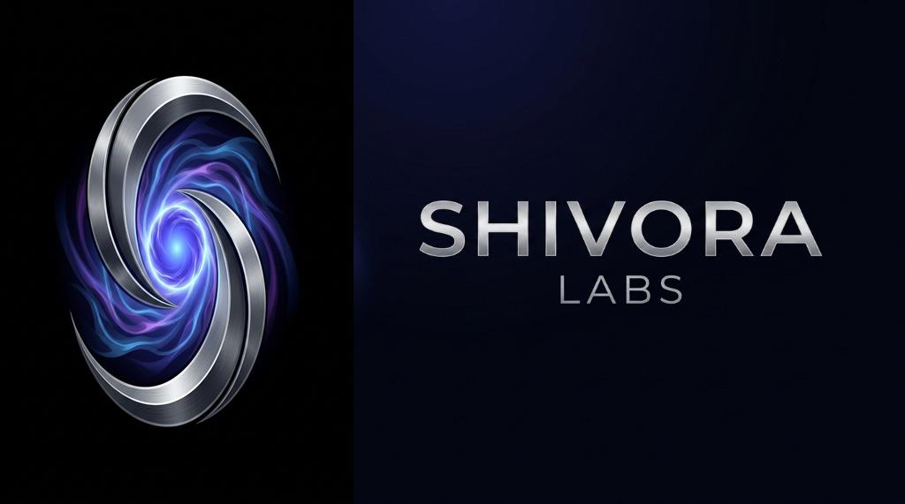
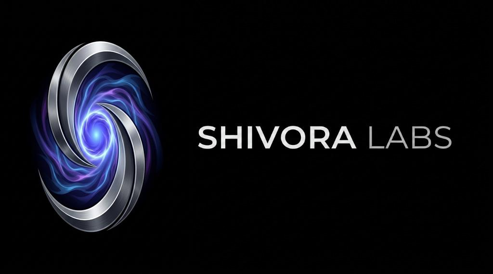
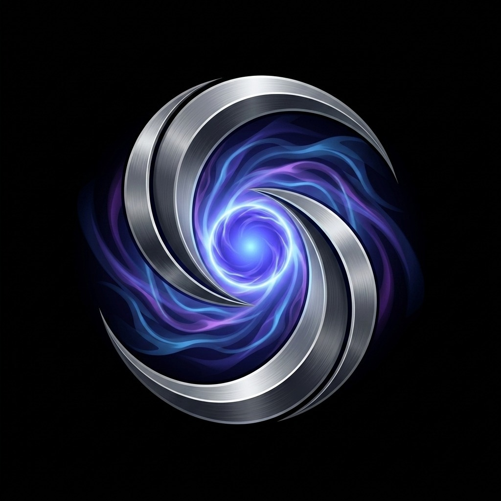

# Shivora Labs — Brand Identity Guide

This document defines the official visual identity and design system for **Shivora Labs**, constructed directly from your finalized high-resolution logo assets.

---

## 1. Logo Assets

### Primary Vertical/Stacked Logo
Used as the standard brand logo on marketing materials, footers, and profiles.
* **Asset Path**: `Website/Icons/shivora_primary_logo.jpg`

---

### Primary Landscape Logo (Horizontal)
Best suited for website navigation headers and wide layout interfaces.
* **Asset Path**: `Website/Icons/shivora_landscape_logo.jpg`

---

### Symbol-Only Logo & Favicon
Standalone metallic vortex mark representing cosmic energy and dynamic flow.
* **Asset Path**: `Website/Icons/shivora_symbol_only.jpg`
* **Favicon Path**: `Website/Icons/shivora_favicon.jpg`

---

## 2. Color Palette

Our palette is inspired by deep space, cosmic light emissions, and premium cybernetics.

| Type | Color Name | Hex Code | Visual Preview | Description |
| :--- | :--- | :--- | :--- | :--- |
| **Primary** | Cosmic Cyan | `#00E5FF` | `████████` | Core glowing energy |
| **Primary** | Electric Blue | `#0052FF` | `████████` | Base vortex ribbon gradient |
| **Primary** | Neon Purple | `#8A2BE2` | `████████` | Deep aura highlight |
| **Secondary**| Deep Space Black | `#090A0F` | `████████` | Canvas / background |
| **Secondary**| Midnight Indigo | `#131520` | `████████` | Cards / secondary containers |
| **Secondary**| Soft Silver | `#E2E4F0` | `████████` | Primary text and sharp metal accents |
| **Accent**   | Aura Violet | `#BD00FF` | `████████` | High-energy glow and buttons |

---

## 3. Typography & Styling Guidelines

To maintain a cutting-edge, tech-native feel, we use clean geometric sans-serif fonts.

### Heading Font: **Sora** (or **Outfit**)
* **Usage**: Page titles, subtitles, and major headers.
* **Feel**: Clean, wide, technological, and premium.

### Body Font: **Inter**
* **Usage**: Body copy, tables, code blocks, and UI elements.
* **Feel**: Highly readable, modern, and neutral.

### Logo Typography Treatment
* **Font**: **Sora** (or equivalent geometric sans-serif)
* **Text**: `SHIVORA LABS`
* **Letter Spacing**: `0.25em` (wide tracking)
* **Case**: UPPERCASE
* **Weight**: Bold (`700` or `800`)

---

## 4. Brand Usage Guide

### Spacing Rules
* Keep a minimum padding equal to 50% of the symbol width (`0.5X`) around all logo bounds.
* Do not overlap elements or text labels over the logo.

### Do's
* **DO** use the logo strictly on dark backgrounds (`#090A0F` or `#131520`).
* **DO** ensure the neon gradient core remains bright and visible.
* **DO** use the Symbol-Only version for social media profiles (Twitter/X, GitHub, LinkedIn).

### Don't's
* **DON'T** stretch, skew, or rotate the logo.
* **DON'T** place the logo on light backgrounds (this ruins the premium glow effect).
* **DON'T** change the colors or add outline styles to the vortex.
